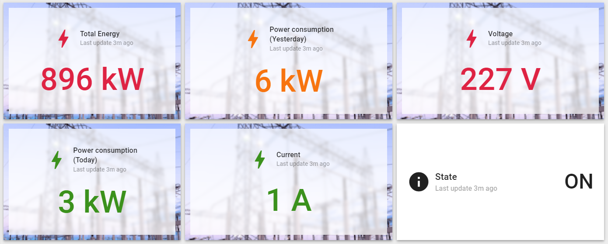
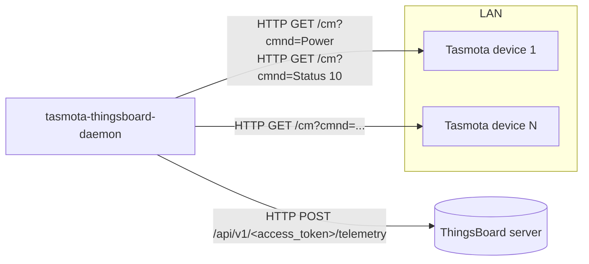
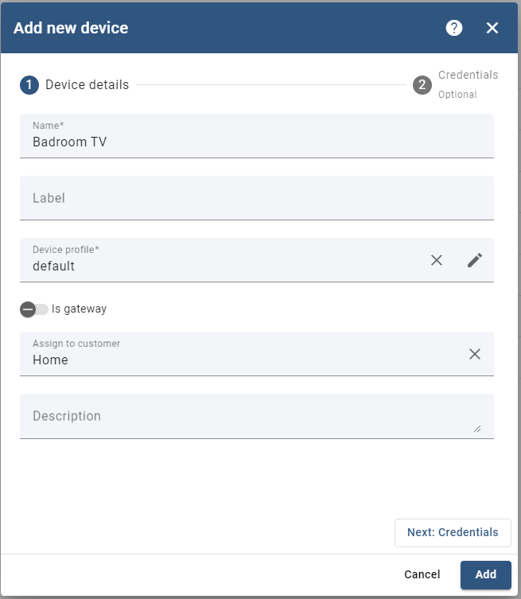

# tasmota-thingsboard-daemon

tasmota-thingsboard-daemon is a bridge between Tasmota devices and a ThingsBoard server.

In today's world, where energy efficiency and sustainability are increasingly important,
monitoring power consumption has become essential for individuals and businesses alike.

Smart technology has changed this process, offering detailed insights into and control over energy usage.
Among these innovations, Tasmota smart sockets stand out as versatile and reliable solutions for managing power consumption in a variety of settings.

This guide covers the intersection of Tasmota smart sockets and the ThingsBoard platform, presenting a complete approach to monitoring power usage. By integrating Tasmota-enabled devices with ThingsBoard, users can use its monitoring capabilities, real-time data visualization, and dashboards to optimize energy efficiency.

The daemon is a small Python service. It periodically polls each configured Tasmota device over HTTP, reads its power state and energy sensor values, and posts them as telemetry to the matching ThingsBoard device through the ThingsBoard HTTP device API.



## Table of contents

- [Features](#features)
- [How it works](#how-it-works)
- [Requirements](#requirements)
- [Getting started](#getting-started)
  - [Installing ThingsBoard using Docker](#installing-thingsboard-using-docker)
  - [Creating a device in ThingsBoard](#creating-a-device-in-thingsboard)
- [Installation](#installation)
- [Configuration](#configuration)
- [Telemetry keys](#telemetry-keys)
- [Troubleshooting](#troubleshooting)
- [Security notes](#security-notes)
- [Development](#development)
- [Contributing](#contributing)
- [License](#license)

## Features

- Polls any number of Tasmota devices listed in a single YAML file.
- Reads the relay state (`Power` command) and the energy sensor values (`Status 10` command).
- Sends one telemetry message per device to ThingsBoard over HTTP(S), authenticated with that device's ThingsBoard access token.
- Sends a first report at startup, then reports every 10 minutes.
- Creates a template `devices.yaml` in the config directory on first run if none exists.
- Ships as a multi-arch Docker image (`linux/amd64`, `linux/arm64`, `linux/arm/v7`).

## How it works



1. On startup the daemon loads `config/devices.yaml`, relative to the current working directory. In the container the working directory is `/app`, so the file is `/app/config/devices.yaml`.
2. For every device it opens an HTTP session to `http://<ip>` with the configured username and password, then runs the Tasmota commands `Power` and `Status 10` through the `/cm` endpoint.
3. It builds a JSON payload from the results (see [Telemetry keys](#telemetry-keys)) and posts it to `<TB_SERVER_ADDRESS>/api/v1/<access_token>/telemetry`, the ThingsBoard HTTP device API.
4. After a successful post it asks the device for its `FriendlyName` and prints `Data sent successfully for <name>`. This line and `Failed to send data: ...` are plain `print()` calls, so in Docker set `PYTHONUNBUFFERED=1` to see them promptly (see [Installation](#installation)).
5. Steps 2–4 run once at startup and then every 10 minutes.

## Requirements

- One or more Tasmota devices with an energy monitoring sensor (for example smart plugs with power metering), reachable over HTTP from the host that runs the daemon.
- A ThingsBoard server (Community Edition or other), reachable over HTTP or HTTPS, with one ThingsBoard device per Tasmota device. See [Getting started](#getting-started).
- Docker (recommended), or Python 3 with `pip` to run from source. The Dockerfile in this repository uses `python:3.14.2-slim-bookworm`. The published `latest` and `1.0.0` images (built on 2024-04-26 from commit `8dfa353`) were built `FROM python:latest`.

## Getting started

### Installing ThingsBoard using Docker

This section explains how to install ThingsBoard, an open-source IoT platform, using Docker. ThingsBoard offers various deployment options, including single-instance setups with different databases and messaging systems. With Docker containers, you can quickly set up and manage a ThingsBoard installation.

#### Running ThingsBoard Docker images

Depending on your requirements and preferences, you can choose from three types of ThingsBoard single-instance Docker images:

* `thingsboard/tb-postgres`: Single instance of ThingsBoard with a PostgreSQL database.
  * Recommended for small servers with at least 1 GB of RAM and minimal load.
  * 2–4 GB of RAM is recommended for optimal performance.
* `thingsboard/tb-cassandra`: Single instance of ThingsBoard with a Cassandra database.
  * The most performant option, requiring at least 4 GB of RAM.
  * 8 GB of RAM is recommended for optimal performance.
* `thingsboard/tb`: Single instance of ThingsBoard with an embedded HSQLDB database.
  * Not recommended for evaluation or production use; suitable only for development and testing.

In this guide, we'll use the `thingsboard/tb-postgres` image. However, you can choose any other image based on your database requirements.

#### Choose the ThingsBoard queue service

ThingsBoard supports various messaging systems/brokers for storing messages and for communication between services. The choice of queue implementation depends on your deployment scenario:

* In Memory: Built-in and default; suitable for development environments but not recommended for production.
* Kafka: Recommended for production deployments, providing scalability and reliability.
* RabbitMQ: Suitable for deployments with low load and existing experience with RabbitMQ.
* AWS SQS, Google Pub/Sub, Azure Service Bus: Fully managed services from cloud providers, useful for cloud deployments.
* Confluent Cloud: Managed streaming platform based on Kafka, suitable for cloud-agnostic deployments.

#### Docker Compose configuration

To set up ThingsBoard with Docker Compose, follow these steps:

* Create a `docker-compose.yml` file.
* Add the necessary configuration, such as port mappings and environment variables.
* Start the Docker containers using Docker Compose.

##### Example Docker Compose configuration

```yaml
version: '3.0'
services:
  mytb:
    restart: always
    image: "thingsboard/tb-postgres"
    ports:
      - "8080:9090"
      - "1883:1883"
      - "7070:7070"
      - "5683-5688:5683-5688/udp"
    environment:
      TB_QUEUE_TYPE: in-memory
    volumes:
      - ~/.mytb-data:/data
      - ~/.mytb-logs:/var/log/thingsboard
```

Explanation of the key settings:

* Port mapping: Maps the host's ports to the ports ThingsBoard exposes inside the container.
* Environment variables: Configures the ThingsBoard queue service (in-memory in this example).
* Volumes: Mounts host directories for data storage and logs.

Before starting the containers, create the directories for data storage and logs and adjust their permissions accordingly.

##### Starting the ThingsBoard Docker containers

Once the Docker Compose file is configured, run the following commands to start ThingsBoard:

```bash
docker compose up -d
docker compose logs -f mytb
```

Replace `mytb` with the name of your service if it is different. After the containers start, you can open ThingsBoard at `http://{your-host-ip}:8080` in your browser.

### Creating a device in ThingsBoard

Each Tasmota device needs a matching device in ThingsBoard. The daemon authenticates to ThingsBoard with that device's **access token**.

1. In ThingsBoard, open **Entities → Devices** and click **+** → **Add new device**. <!-- TODO: verify menu path for your ThingsBoard version -->
2. Enter a name (and optionally a label, device profile and customer), then click **Next: Credentials**.

   

3. Keep the credentials type **Access token**. Either type your own token or keep the generated one, and copy it.
4. Click **Add**.
5. Put the token into the `access_token` field of the matching entry in `devices.yaml` (see [Configuration](#configuration)).

Once the daemon runs, the device's **Latest telemetry** tab shows the keys listed under [Telemetry keys](#telemetry-keys), and you can build a dashboard from them like the one shown at the top of this page.

## Installation

The published image is `techblog/tasmota-thingsboard-bridge` on Docker Hub (tags `latest` and `1.0.0`, for `linux/amd64`, `linux/arm64` and `linux/arm/v7`).

> **Note:** `REPORT_INTERVAL` must be set to an integer. The daemon converts it with `int()` at startup and exits if it is empty or missing. Its value is currently not used; see [Configuration](#configuration).

### Docker Compose

The repository ships this `docker-compose.yaml`:

```yaml
---
version: "3.7"

services:

  tasmota-thingsboard-bridge:
    image: techblog/tasmota-thingsboard-bridge
    container_name: tasmota-thingsboard-bridge
    restart: always
    environment:
      - TB_SERVER_ADDRESS= #eg. http://localhost:8080 http://my-server.addrsss https://mytb.com
      - REPORT_INTERVAL= #In minutes
    volumes:
      - ./tasmota-tb/config:/app/config
```

Fill in the two environment variables, for example:

```yaml
    environment:
      - TB_SERVER_ADDRESS=http://thingsboard.example.lan:8080
      - REPORT_INTERVAL=10
      - PYTHONUNBUFFERED=1
```

`PYTHONUNBUFFERED=1` is not required, but it is recommended. The Dockerfile does not set it, and the `Data sent successfully` / `Failed to send data` lines are written with `print()`, so without it they can show up late in `docker compose logs`, or not at all.

Then:

```bash
docker compose up -d
```

On the first start the daemon copies a template `devices.yaml` into `./tasmota-tb/config/`. Edit it (see [devices.yaml](#devicesyaml)) and restart the container:

```bash
docker compose restart tasmota-thingsboard-bridge
docker compose logs -f tasmota-thingsboard-bridge
```

### Docker run

```bash
mkdir -p ./tasmota-tb/config
docker run -d \
  --name tasmota-thingsboard-bridge \
  --restart always \
  -e TB_SERVER_ADDRESS=http://thingsboard.example.lan:8080 \
  -e REPORT_INTERVAL=10 \
  -e PYTHONUNBUFFERED=1 \
  -v "$(pwd)/tasmota-tb/config:/app/config" \
  techblog/tasmota-thingsboard-bridge:latest
```

### From source

The code resolves `config/devices.yaml` and the `devices.yaml` template relative to the current working directory, so run it from the `app` directory:

```bash
git clone https://github.com/t0mer/tasmota-thingsboard-daemon.git
cd tasmota-thingsboard-daemon
python3 -m venv .venv && . .venv/bin/activate
pip install -r requirements.txt
cd app
mkdir -p config
cp devices.yaml config/devices.yaml   # then edit config/devices.yaml
TB_SERVER_ADDRESS=http://thingsboard.example.lan:8080 REPORT_INTERVAL=10 python app.py   # use python3 if no venv is active
```

## Configuration

### Environment variables

| Variable | Default | Required | Description |
|---|---|---|---|
| `TB_SERVER_ADDRESS` | none (empty in the Docker image) | Yes | Base URL of the ThingsBoard server, including scheme and port, without a trailing slash. Examples: `http://localhost:8080`, `https://tb.example.com`. The daemon posts to `<TB_SERVER_ADDRESS>/api/v1/<access_token>/telemetry`. |
| `REPORT_INTERVAL` | none (empty in the Docker image) | Yes | Must be an integer, otherwise the daemon exits at startup. It is meant as the report interval in minutes, but the current code ignores it and always reports every **10 minutes**. |

### Config directory

| Location | Path |
|---|---|
| Docker container | `/app/config/devices.yaml` (mount a host directory on `/app/config`) |
| From source | `app/config/devices.yaml` |

If the file does not exist, the daemon copies the template `app/devices.yaml` into the config directory at startup. The template contains no values, so no device is reported until you edit it and restart.

### devices.yaml

The file has a top-level `devices` list. Each entry describes one Tasmota device:

| Key | Required | Description |
|---|---|---|
| `name` | No | Free-text label for your own reference. The code does not read it; the log uses the device's Tasmota `FriendlyName` instead. |
| `ip` | Yes | IP address or hostname of the Tasmota device. The daemon always uses plain `http://`. |
| `username` | Yes | Username sent with HTTP basic authentication. Tasmota's web user is `admin`. |
| `password` | Yes | Tasmota web password. Leave it empty (`""`) if the device has no web password. |
| `access_token` | Yes | Access token of the matching device in ThingsBoard. |

All of `ip`, `username`, `password` and `access_token` must be present on every entry. If a key is missing, loading stops at that entry, an error is logged, and only the entries before it are used.

Example with placeholders:

```yaml
devices:
  - name: Living room plug
    ip: 192.0.2.10
    username: admin
    password: "<tasmota-web-password>"
    access_token: "<thingsboard-device-access-token>"
  - name: Washing machine
    ip: 192.0.2.11
    username: admin
    password: ""
    access_token: "<thingsboard-device-access-token>"
```

> **Tasmota authentication:** the daemon sends the credentials as HTTP basic authentication. Tasmota's `/cm` endpoint documents `user` and `password` query parameters for password-protected devices, so devices with a web password may reject the requests. <!-- TODO: verify that HTTP basic auth works against a password-protected Tasmota /cm endpoint -->

## Telemetry keys

Each report sends one JSON object per device with these keys (exact names as sent):

| Key | Tasmota source | Typical unit |
|---|---|---|
| `state` | `POWER` from the `Power` command | `ON` / `OFF` |
| `Total Energy` | `StatusSNS.ENERGY.Total` from `Status 10` | kWh |
| `Yesterday Energy` | `StatusSNS.ENERGY.Yesterday` from `Status 10` | kWh |
| `Today Energy` | `StatusSNS.ENERGY.Today` from `Status 10` | kWh |
| `Voltage` | `StatusSNS.ENERGY.Voltage` from `Status 10` | V |
| `Current` | `StatusSNS.ENERGY.Current` from `Status 10` | A |

Example payload:

```json
{
  "state": "ON",
  "Total Energy": 896.123,
  "Yesterday Energy": 6.2,
  "Today Energy": 3.1,
  "Voltage": 227,
  "Current": 1.05
}
```

Use these key names when you add widgets to a ThingsBoard dashboard. The daemon sends no timestamp, so ThingsBoard stores each value with the server's receive time.

## Troubleshooting

- **The container exits right after start with `ValueError: invalid literal for int()` or `TypeError`**: `REPORT_INTERVAL` is empty or missing. Set it to an integer (for example `10`).
- **Nothing is reported and the log shows an error while loading devices**: `config/devices.yaml` is still the empty template, or an entry is missing one of `ip`, `username`, `password` or `access_token`. Fix the file and restart.
- **The process crashes (and the container restarts) with a connection error or `'NoneType' object has no attribute 'get'`**: one of the Tasmota devices is unreachable, returned a non-200 response (for example wrong credentials), or has no energy sensor (no `StatusSNS.ENERGY` in `Status 10`). Errors while talking to a device are not caught, so a single failing device stops the whole report run. Check that `http://<ip>/cm?cmnd=Status%2010` returns `StatusSNS.ENERGY` in a browser.
- **No `Data sent successfully` or `Failed to send data` lines in `docker compose logs`**: these lines come from `print()`, and the image does not set `PYTHONUNBUFFERED`, so Python buffers them. Add `PYTHONUNBUFFERED=1` to the container environment and restart it.
- **`Failed to send data: ...`**: the post to ThingsBoard failed. Check `TB_SERVER_ADDRESS` (scheme, host, port, no trailing slash) and the device's access token. A `401` usually means the token does not match any ThingsBoard device.
- **The interval does not change when I change `REPORT_INTERVAL`**: expected with the current code; the interval is fixed at 10 minutes.

## Security notes

- **ThingsBoard access tokens** are the only credential for writing telemetry to a device. Anyone who has a token can post data as that device. Keep `devices.yaml` out of version control and restrict its file permissions. If a token leaks, regenerate it on the device's credentials page in ThingsBoard.
- **Tasmota over plain HTTP**: the daemon talks to devices over unencrypted HTTP, so device passwords and data cross the network in clear text. Tasmota devices without a web password accept commands from anyone on the network. Keep them on a trusted or isolated network segment, and set a web password where your setup allows it.
- **ThingsBoard over TLS**: `TB_SERVER_ADDRESS` accepts `https://` URLs, and the certificate is verified by the `requests` library. Use HTTPS whenever the ThingsBoard server is reached over an untrusted network.

## Development

### Project layout

```
app/
  app.py          # entry point: loads devices, schedules and sends reports
  device.py       # Tasmota HTTP client (Power, FriendlyName, Status 10)
  devices.yaml    # template copied to config/devices.yaml on first run
  defauly.py      # standalone counter loop, not used by the daemon
Dockerfile        # python:3.14.2-slim-bookworm image, runs app.py
docker-compose.yaml
requirements.txt
VERSION           # version used for the Docker Hub image tag
screenshots/
```

Note: `app/defauly.py` is misspelled and not imported anywhere.

### Building the image locally

```bash
docker build -t tasmota-thingsboard-bridge:dev .
```

The Dockerfile installs `pyyaml`, `requests`, `loguru` and `schedule` directly (it does not use `requirements.txt`).

### CI workflows

| Workflow | File | Trigger | Publishes |
|---|---|---|---|
| Docker Build | `.github/workflows/docker-image.yml` | Manual (`workflow_dispatch`), or after a workflow named `Create Release` completes | `techblog/tasmota-thingsboard-bridge:latest` and `:<VERSION>` on Docker Hub, for `linux/amd64`, `linux/arm64`, `linux/arm/v7` |
| Publish to GHCR | `.github/workflows/publish-ghcr.yml` | Manual, with an optional `tag` input (default `latest`) | `ghcr.io/t0mer/tasmota-thingsboard-bridge:<tag>` and `:latest`, same platforms |

At the time of writing, Docker Hub has the tags `latest` and `1.0.0`. The `VERSION` file says `1.1.0`, which has not been published. No image is publicly available on GHCR yet, and the repository has no GitHub releases or git tags.

## Contributing

Issues and pull requests are welcome. Please keep changes small and focused, and describe how you tested them against a real Tasmota device and ThingsBoard instance.

## License

This project is licensed under the [Apache License 2.0](LICENSE).
